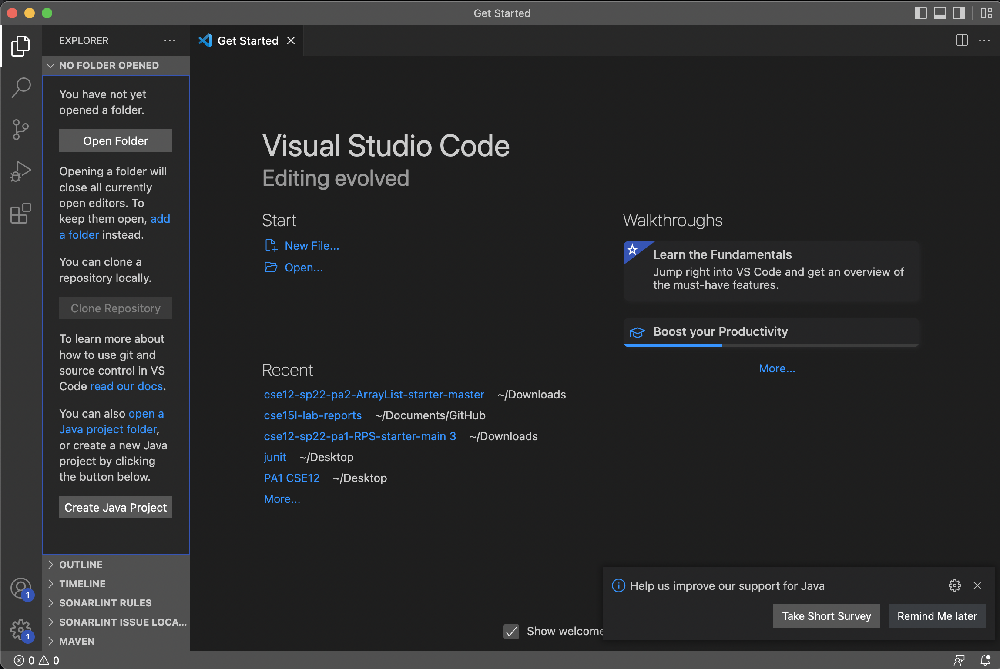
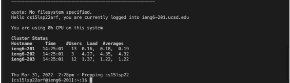
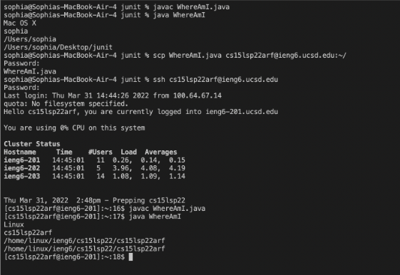
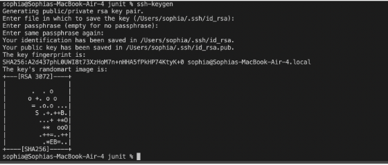

# TUTORIAL FOR INCOMING 15L STUDENTS 
---
## 1. Installing VScode 
#### Download VScode here:


[VScode](https://code.visualstudio.com/download)


#### Once you've downloaded VScode, it should look like this: 




## 2. Install OpenSSH 
#### If you have Windows, install a program called OpenSSH

## 3. Course-specific account for CSE15L 
#### You can look up your course-specific account here:


[CSE 15L ACC](https://sdacs.ucsd.edu/~icc/index.php)


## 4. Remotely Connecting 
1. Open the terminal in VScode by doing (Ctrl + `)
2. Type in this command: 


``` java
$ ssh cs15lsp22zzz@ieng6.ucsd.edu 
```
#### Keep in mind to replace the zzz with your personal coure-specific account you found in step 3
3. If it is your first time connecting to this server, you will get a message asking


``` "Are you sure you want to continue connecting (yes/no/[fingerprint])?``` 


4. Type yes and give your password 
5. It should look somewhat like this: 





#### Your terminal is now connnected to a computer in the CSE basement. 

---

## 5. Practice some commands!! 
#### try:
1. cs 
2. ls -lat
3. ls -a 
4. etc... 


## 6. Moving files with scp
1. Create a file on VScode called WhereAmI.java and put the following inside:
``` java
class WhereAmI {
  public static void main(String[] args) {
    System.out.println(System.getProperty("os.name"));
    System.out.println(System.getProperty("user.name"));
    System.out.println(System.getProperty("user.home"));
    System.out.println(System.getProperty("user.dir"));
  }
}
```

2. Run this inside the terminal:
``` java
scp WhereAmI.java cs15lsp22zzz@ieng6.ucsd.edu:~/
```


#### Keep in mind to replace the zzz with your course-specific account 

3. It will prompt you to enter a password, so do so
4. It should look somewhat like this: 





## 7. Setting an SSH key 
#### You have probably noticed that it is very tedious to re-enter password. Here is a way we can fix that. 


1. We are going to create 2 files: public key and private key 
2. We are going to copy the public key to the server, and the private key on the client by using the ssh command
3. Type this in the terminal:  
``` java
ssh-keygen
``` 

```java
(/Users/<user-name>/.ssh/id_rsa): /Users/<user-name>/.ssh/id_rsa 
```


  5. It'll ask you to enter passphrase and make sure to note add a paraphrase for this step! So, just click enter 
  6. Now type this into the terminal:
  ``` java 
  ssh cs15lsp22zzz@ieng6.ucsd.edu
  ```
  
#### then enter your password 
#### then type this:
 ``` java 
 mkdir .ssh
 ``` 
#### then this:
  ``` java
  $ scp /Users/<user-name>/.ssh/id_rsa.pub
cs15lsp22zz@ieng6.ucsd.edu:~/.ssh/authorized_keys
``` 
#### (except replace it to your username and the path you saw in the command)
  7. It'll look like this:


  
  
  
  8. Now we can ssh or scp into the server without entering password!

  
## 8. Optimizing Remote Running 
Try running more commands on the terminal. Use the up arrow key on the keyboard and you should notice that the previous commands you wrote on the terminal will appear. This makes it more time efficient. 


