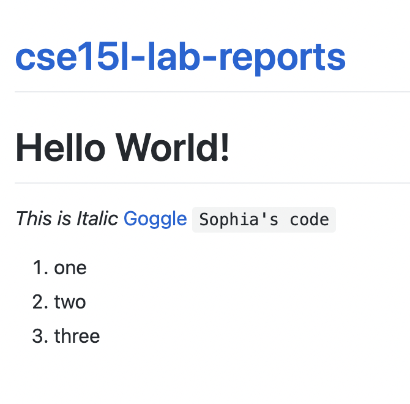

# TUTORIAL FOR INCOMING 15L STUDENTS 
## 1. Installing VScode 
--- 
Download VScode here:
[VScode](https://code.visualstudio.com/download)
Once you've downloaded VScode, it should look like this: 

---

