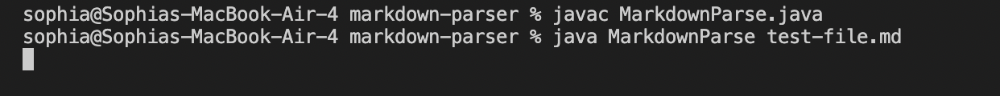
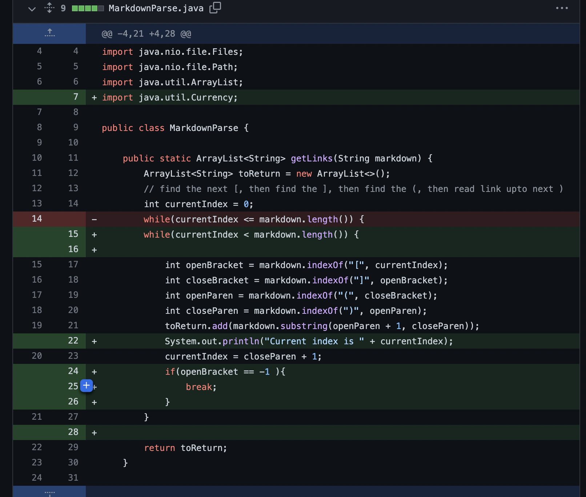
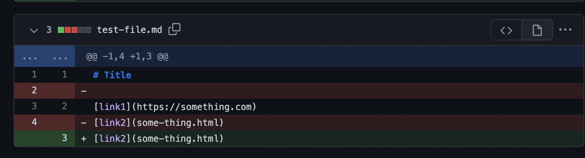
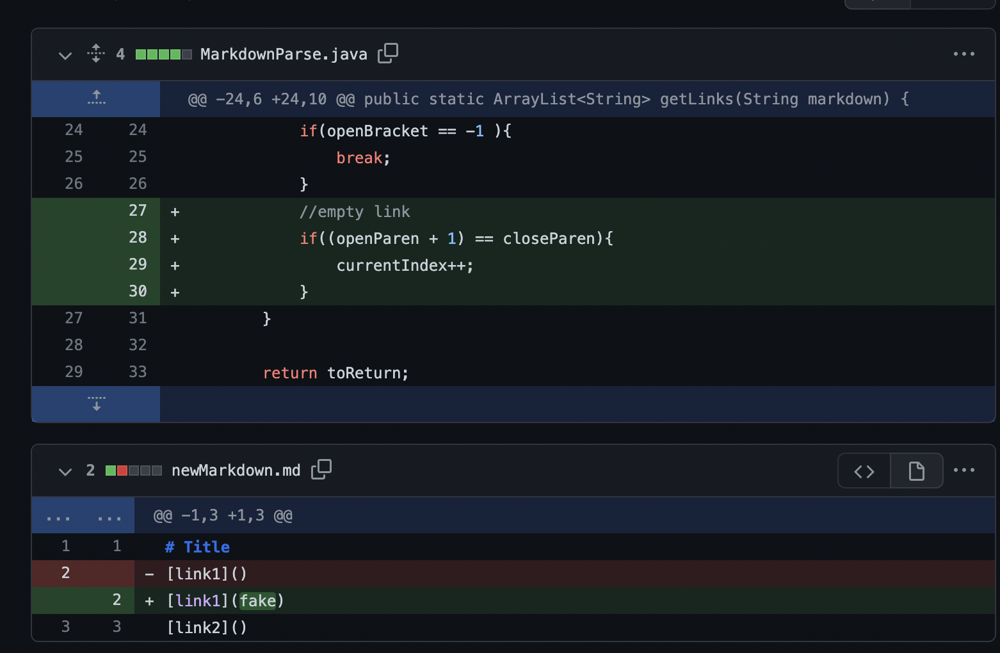
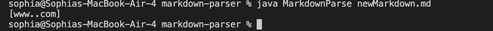
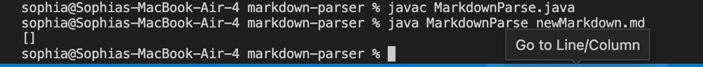

# Lab Report 2
---
#### Three code changes:

1.

#### The first issue was that the the code was running on an infinite loop with no output. This was due to an empty line in the code. The image below shows the output:

#### In order to fix the infiinite loop, I created a condition checking when open bracket is equal to -1, to just break (stop the code). The code exits the loops if it can't find theh index of the open bracket.

#### I also deleted the extra space in between the two links in test-file.md:

[Link to test file](https://github.com/sophiaashraf/markdown-parser/commit/e64d7ec268d4cffc10c149765d3048fc5537fa03)

 2. 
 
 
#### The second issue was was when the link would be empty, the output would still print an extra space and comma. 

#### In order to fix this issues, I created a condition checking if the link was empty by checking if the openParen and closeParen had adjacent indexes. If that condition was true, then the currentIndex would increment to check the next line. 

[Link to test file](https://github.com/sophiaashraf/markdown-parser/commit/b1aaf009e2d58ddd617767cf59adb8554ba8e187)

3.

#### The third issue was that the code wouldn't recognize that "!" in front of the bracket means image. The image below shows the incorrect output:

#### By fixing it, I created a condition checking if the index before the open bracket was "!" to skip that line and continue. 

[Link to test file]()
