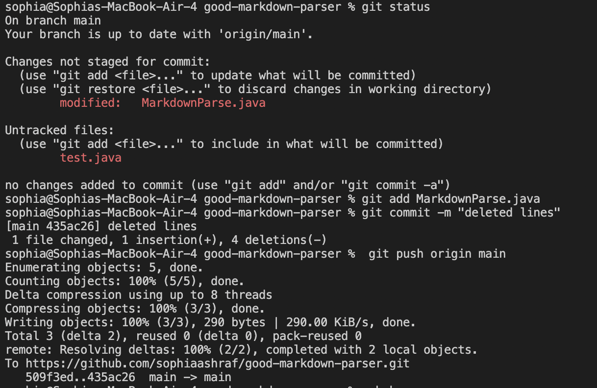

## Lab report 3

### Streamlining ssh Configuration
I created the config file using the touch command in the terminal. Here is what I put inside the file:

Next, I was able to type ssh ieng6 to log into my ssh without typing the whole line:

We can also use scp, instead of writing out cs15lsp22

### Setup Github Access from ieng6
Here we can see that the public key is represented by id_rsa.pub, and the private key is id_rsa.

Here we can commit and push:

[Link for the commit](https://github.com/sophiaashraf/good-markdown-parser/commit/435ac2624fce4f4151e6024385b39c904375a0d7)

