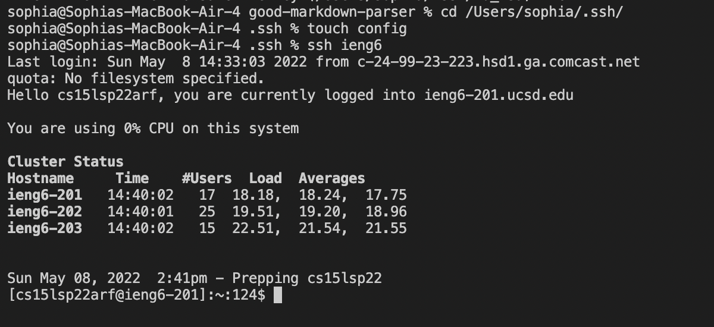

## Lab report 3

### Streamlining ssh Configuration
I created the config file using the touch command in the terminal. Here is what I put inside the file:

Next, I was able to type ssh ieng6 to log into my ssh without typing the whole line:

We can also use scp, instead of writing out cs15lsp22

Here we see a scp command copying a file to your account:

### Setup Github Access from ieng6
Here we can see that the public key is represented by id_rsa.pub, and the private key is id_rsa.

Here we created an SSH key 

Here we can commit and push with our ssh account:

[Link for the commit](https://github.com/sophiaashraf/SkillDemoo/commit/d1a18e66d86ca6c00d56db69729004a6dec3d6d2)

### Copying whole directories with scp -r

Copying your whole markdown-parse directory to your ieng6:

Show logging into your ieng6 account after doing this and compiling and running the tests for your repository:

Combining scp, ;, and ssh to copy the whole directory and run the tests in one line.

