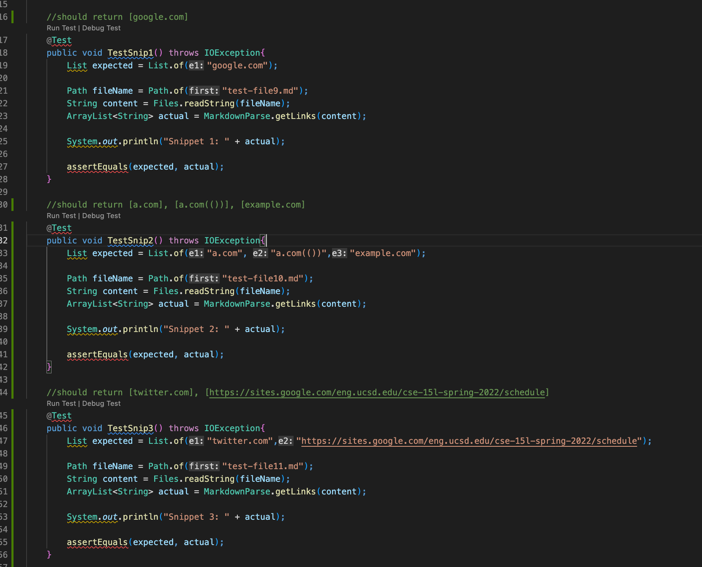
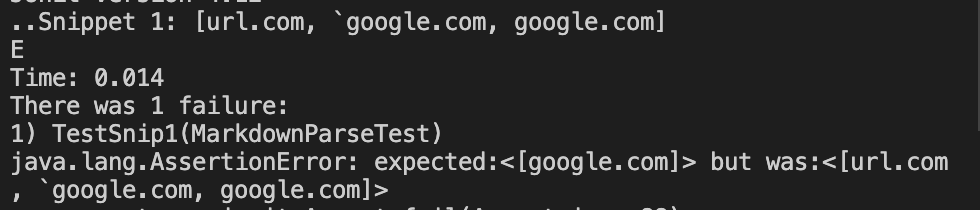
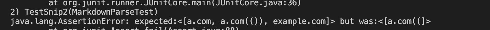
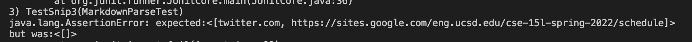
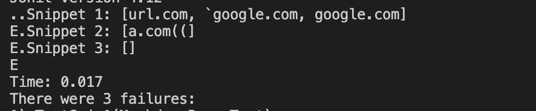
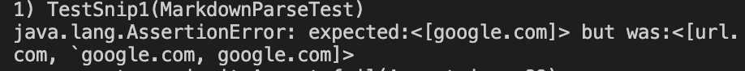
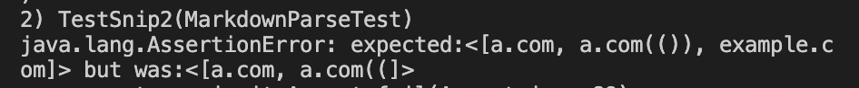
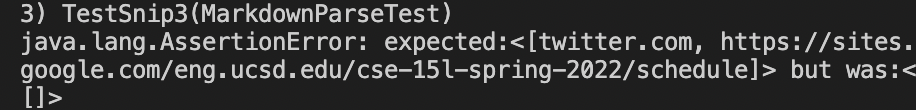
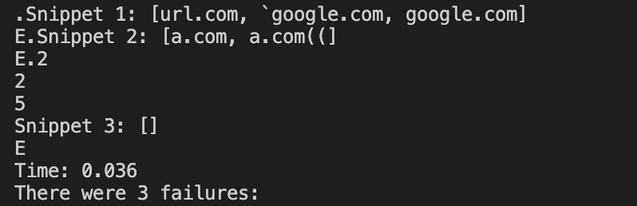

## Lab Report  
[Link to our Markdown Parser](https://github.com/sophiaashraf/good-markdown-parser)

MarkdownParseTest.java test and expected output 

Our Markdown Parse result: 
1. snippet 1 failed 
2. snippet 2 failed 
3. snippet 3 failed 

The reviewed Markdown Parse result:
1. snippet 1 failed 
2. snippet 2 failed 
3. snippet 3 failed 

Answer the following questions with 2-3 sentences each:
1. Do you think there is a small (<10 lines) code change that will make your program work for snippet 1 and all related cases that use inline code with backticks? If yes, describe the code change. If not, describe why it would be a more involved change.
I think it could be done in a bit more than 10 lines. This is because there would be a for loop to find the indices of where the back ticks are, then more conditions after.  

2. Do you think there is a small (<10 lines) code change that will make your program work for snippet 2 and all related cases that nest parentheses, brackets, and escaped brackets? If yes, describe the code change. If not, describe why it would be a more involved change.

I think there is a small code change for snippet 2. This would involve a while loop checking for for even number of parentheses or brackets. 

3. Do you think there is a small (<10 lines) code change that will make your program work for snippet 3 and all related cases that have newlines in brackets and parentheses? If yes, describe the code change. If not, describe why it would be a more involved change.

I think there would be a bit longer than 10 lines because it would involve checking multiple lines since the texts are really long. It would also involve checking brackets and parentheses, which could get complicated. 
