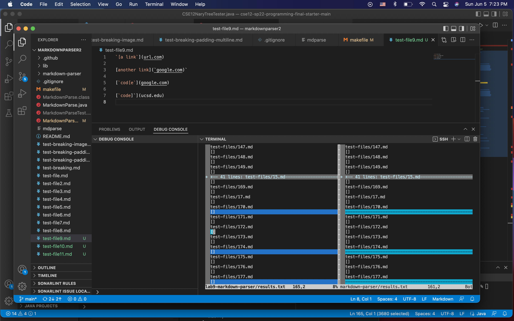

## Week 10 lab report 5
1. I used vimdiff on the results.txt files that I created for the cloned Markdown parser and my group Markdown parser. I did bash script.sh > results.txt for both directories. 
2. Different results shown here: (test 170 and test 174)

Links to different tests:

[Test 170 markdown file](https://github.com/nidhidhamnani/markdown-parser/blob/main/test-files/170.md)

[Test 170 html](https://github.com/nidhidhamnani/markdown-parser/blob/main/test-files/170.html.test)

[Test 174 markdown file](https://github.com/nidhidhamnani/markdown-parser/blob/main/test-files/174.md)

[Test 174 html](https://github.com/nidhidhamnani/markdown-parser/blob/main/test-files/174.html.test)

The given Markdown Parser is on the left, and my group MarkdownParser on the right. 

The issue for both can be that our implementation of Markdown Parse only looks for [] [() and if those don’t exist, it skips it. 
